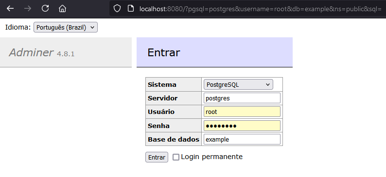
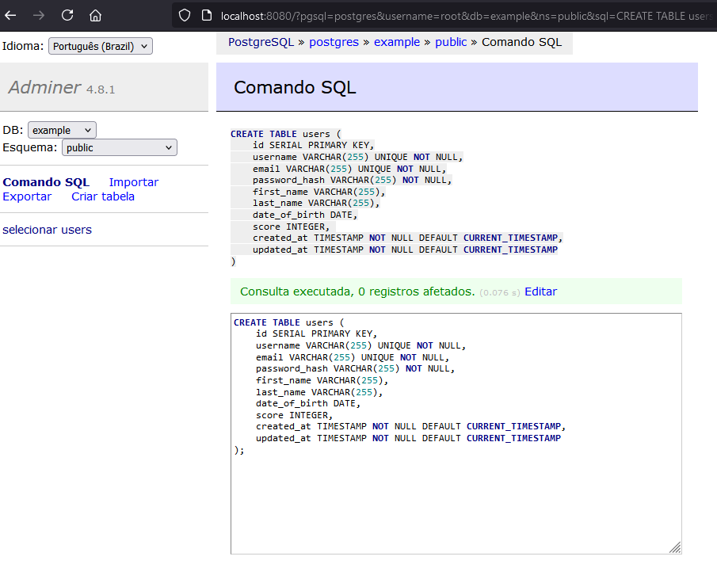
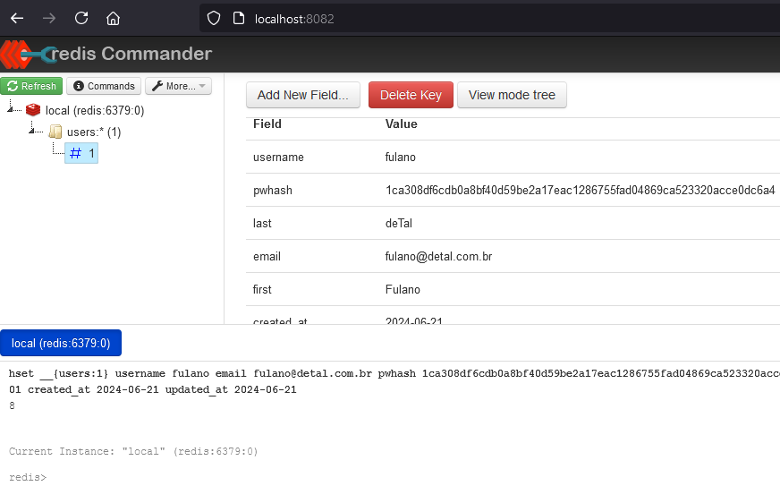

# Write Through Cache Strategy using Redis
<br>

## Run the stack
```bash
cd redis-write-through-caching-strategy

docker compose up -d
```
## Create database table

Access `Adminer`: http://localhost:8080/?pgsql=postgres&username=root&db=example&ns=public&sql=



Run SQL command:

```sql
CREATE TABLE users (
    id SERIAL PRIMARY KEY,
    username VARCHAR(255) UNIQUE NOT NULL,
    email VARCHAR(255) UNIQUE NOT NULL,
    password_hash VARCHAR(255) NOT NULL,
    first_name VARCHAR(255),
    last_name VARCHAR(255),
    date_of_birth DATE,
    score INTEGER, 
    created_at TIMESTAMP NOT NULL DEFAULT CURRENT_TIMESTAMP,
    updated_at TIMESTAMP NOT NULL DEFAULT CURRENT_TIMESTAMP
);
```


## Create a RedisGears recipe

The Python code inside `write-trough.py` file will write through to the PostgreSQL database. Load Python file and `requirements.txt` into the Redis server: 

```bash
pip install gears-cli

gears-cli run --host localhost --port 6379 write-through.py --requirements requirements.txt
```

## Verify that RedisGears is syncing data between Redis and PostgreSQL and create three test users

Access `Redis Commander` http://localhost:8082 and execute following commands in the Redis command line: 

```redis
hset __{users:1} username fulano email fulano@detal.com.br pwhash d1e8a70b5ccab1dc2f56bbf7e99f064a660c08e361a35751b9c483c88943d082 first Fulano last deTal dob 1981-01-01 score 0 created_at 2024-06-21 updated_at 2024-06-21
```
```redis
hset __{users:2} username beltrano email beltrano@detal.com.br pwhash d1e8a70b5ccab1dc2f56bbf7e99f064a660c08e361a35751b9c483c88943d082 first Beltrano last deTal dob 1981-01-01 score 0 created_at 2024-06-22 updated_at 2024-06-22
```
```redis
hset __{users:3} username sicrano email sicrano@detal.com.br pwhash d1e8a70b5ccab1dc2f56bbf7e99f064a660c08e361a35751b9c483c88943d082 first Sicrano last deTal dob 1981-01-01 score 0 created_at 2024-06-23 updated_at 2024-06-23
```



## Testing

Install dependencies

```bash
pip install -r requirements.txt
```

Run `producer.py` to generate update messages

```bash
python producer.py config.ini
```

Run `consumer.py` to update cache/pgsql

```bash
python consumer.py config.ini
```

Access `Adminer` and `Redis Commander` to see cache and data updates

[Adminer](http://localhost:8080/?pgsql=postgres&username=root&db=example&ns=public&select=users)

[Redis Commander](http://localhost:8082)

<br>

# References

[1] https://redis.io/learn/howtos/solutions/caching-architecture/write-through#additional-resources <br>